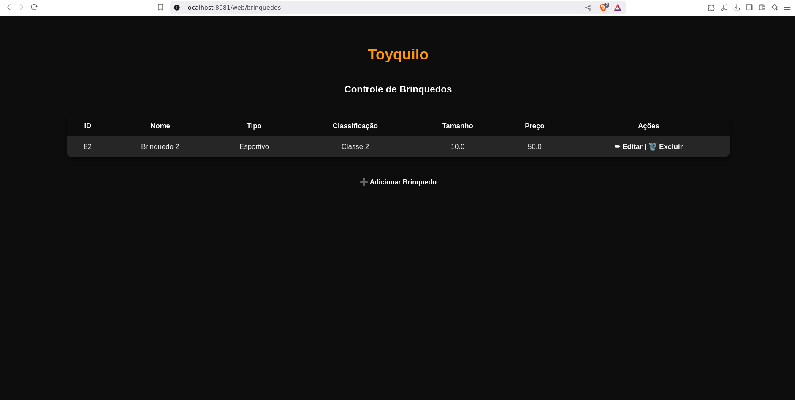
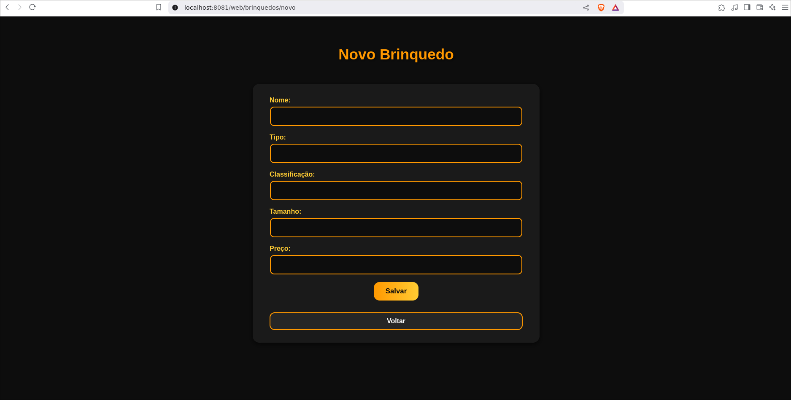
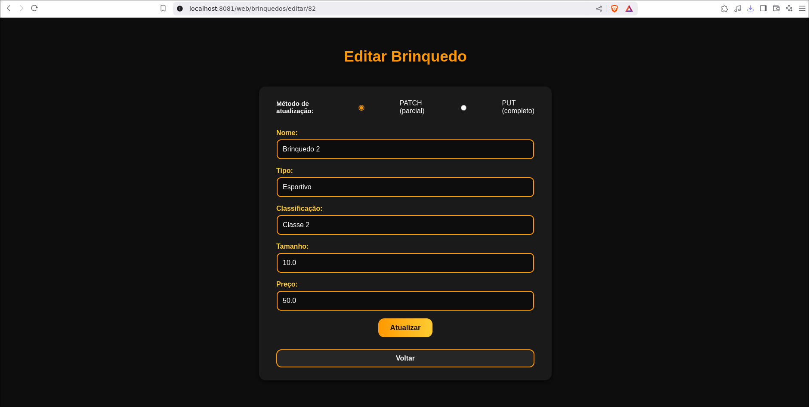

# Toyquilo - Sistema de Gerenciamento de Brinquedos Esportivos PT 2

Projeto desenvolvido para o exercício de revisão da disciplina **Spring com Persistência, Lombok, HATEOAS e Deploy**  
FIAP – Faculdade de Informática e Administração Paulista  
Curso: **Tecnologia em Análise e Desenvolvimento de Sistemas (TDS)**  
Professor: **Dr. Marcel Stefan Wagner**

---

## Autores

- **Daniel Saburo Akiyama** – RM 558263  
- **Danilo Correia e Silva** – RM 557540  
- **João Pedro Rodrigues da Costa** – RM 558199  

---

## Objetivo

Criar uma API REST para gerenciamento de brinquedos esportivos para crianças até 12 anos, com CRUD completo e persistência em banco de dados **Oracle**.

O sistema deve permitir **criar, listar, buscar, atualizar e excluir brinquedos**, com documentação via **Swagger/OpenAPI** e retorno seguindo o padrão **HATEOAS**.

---

## Tecnologias Utilizadas

- **Java 21+**  
- **Spring Boot** (Maven)  
- **Spring Data JPA**  
- **Lombok**  
- **HATEOAS**  
- **Swagger / SpringDoc OpenAPI**  
- **Thymeleaf**
- **Banco Oracle (Oracle SQL Developer)**  
- **Postman/Insomnia** para testes  
- **Render** para deploy em plataforma de hospedagem  
- **IntelliJ IDEA** (IDE utilizada para desenvolvimento)  

---

## Estrutura do Projeto

```
src/
 └── main/
     ├── java/br/com/fiap/toyquilo
     │   ├── model/          # Entidade Brinquedo
     │   ├── repository/     # Interface de persistência JPA
     │   ├── service/        # Lógica de negócio
     │   ├── controller/     # Endpoints REST com HATEOAS
     │   └── configuration/  # Configuração do Swagger
     └── resources/
         ├── static/
         │   └── css/        # Estilização das páginas HTML no template/
         ├── templates/      # Páginas do Thymeleaf
         └── application.properties
Dockerfile
```

---

## Configuração do Banco

### Banco de Dados Oracle
- Criar a tabela:

```sql
CREATE TABLE TDS_TB_BRINQUEDO (
    ID NUMBER PRIMARY KEY,
    NOME VARCHAR2(100) NOT NULL,
    TIPO VARCHAR2(50) NOT NULL,
    CLASSIFICACAO VARCHAR2(50) NOT NULL,
    TAMANHO FLOAT NOT NULL,
    PRECO FLOAT NOT NULL
);
```

- Criar a sequence:
```sql
CREATE SEQUENCE seq_brinquedo_id START WITH 1 INCREMENT BY 1;
```

---

### Como configurar o .env para rodar localmente

```env
ORACLEHOST=<HOSTDAFIAP>
ORACLEPORT=1521
ORACLEDATABASE=<DATABASE>
ORACLEUSER=<USERNAME>
ORACLEPASSWORD=<SENHA>
```

---

## Executando o Projeto

```bash
git clone https://github.com/danielthx23/exercicio-revisao-java-fiap-pt2.git
cd exercicio-revisao-java-fiap-pt2

mvn spring-boot:run
```

A API ficará disponível em:  
**http://localhost:8081**

Documentação Swagger:  
**http://localhost:8081/swagger-ui.html**

Interface Web:  
**http://localhost:8081/web/brinquedos**

---

## Endpoints e Explicações

### 1. Listar todos os brinquedos  
`GET /brinquedos`

- Retorna uma lista de todos os brinquedos cadastrados no banco de dados.  
- Inclui links HATEOAS para cada recurso individual e para a coleção.  

**Resposta (200)**:
```json
[
  {
    "id": 1,
    "nome": "Bola de Futebol",
    "tipo": "Bola",
    "classificacao": "Infantil",
    "tamanho": 0.3,
    "preco": 50.0,
    "_links": {
      "self": { "href": "http://localhost:8081/brinquedos/1" },
      "brinquedos": { "href": "http://localhost:8081/brinquedos" }
    }
  }
]
```

---

### 2. Buscar brinquedo por ID  
`GET /brinquedos/{id}`

- Retorna um único brinquedo pelo seu **ID**.  
- Caso não exista, retorna **404 – Not Found**.  

---

### 3. Criar brinquedo  
`POST /brinquedos`

- Cria um novo brinquedo na base de dados.  
- O ID é gerado automaticamente pela sequence no Oracle.  

**Corpo JSON de requisição**:
```json
{
  "nome": "Carrinho de Controle Remoto",
  "tipo": "Veículo",
  "classificacao": "Infantil",
  "tamanho": 0.5,
  "preco": 150.0
}
```

**Resposta (201 Created)** com link para o recurso criado.  

---

### 4. Atualizar brinquedo (PUT)  
`PUT /brinquedos/{id}`

- Atualiza **todos os campos** de um brinquedo existente.  
- Caso o ID não exista, retorna **404 – Not Found**.  

---

### 5. Atualização Parcial (PATCH)  
`PATCH /brinquedos/{id}`

- Permite atualizar apenas **alguns campos** do brinquedo (ex: preço ou nome).  
- Ideal para mudanças parciais sem precisar sobrescrever o objeto inteiro.  

Exemplo de corpo JSON:  
```json
{
  "preco": 180.0
}
```

---

### 6. Deletar brinquedo  
`DELETE /brinquedos/{id}`

- Exclui definitivamente o brinquedo do banco de dados.  
- Retorna **204 No Content** em caso de sucesso.  

---

## Deploy

O projeto foi implantado na plataforma Render e pode ser acessado no link:

🔗 exercicio-revisao-java-fiap-pt2.onrender.com

- API: https://exercicio-revisao-java-fiap-pt2.onrender.com/brinquedos  
- Swagger: https://exercicio-revisao-java-fiap-pt2.onrender.com/swagger-ui.html  
- Interface Web: https://exercicio-revisao-java-fiap-pt2.onrender.com/web/brinquedos

---

## Guia Interface Web

## Aba de listagem de brinquedos

**URL:**
```
https://exercicio-revisao-java-fiap-pt2.onrender.com/web/brinquedos
```



Nesta tela são exibidos todos os brinquedos cadastrados no sistema.

- **Botão Criar Brinquedo** → redireciona para o formulário de criação de um novo brinquedo.
- **Botão Editar** → abre o formulário de edição do brinquedo selecionado.
- **Botão Excluir** → remove o brinquedo da listagem após confirmação.

---

## Formulário de criação de brinquedo

**URL:**
```
https://exercicio-revisao-java-fiap-pt2.onrender.com/web/brinquedos/novo
```



Nesta tela é possível **adicionar um novo brinquedo** ao sistema.

Campos do formulário:
- **Nome** → nome do brinquedo *(obrigatório)*.
- **Tipo** → tipo do brinquedo (ex: eletrônico, educativo, pelúcia).
- **Classificação** → faixa etária ou classificação indicada.
- **Tamanho** → tamanho do brinquedo *(obrigatório, em centímetros ou outra unidade definida)*.
- **Preço** → valor do brinquedo *(obrigatório)*.

Ao preencher os campos e salvar, o brinquedo será incluído na listagem.

---

## Formulário de edição de brinquedo

**URL:**
```
https://exercicio-revisao-java-fiap-pt2.onrender.com/web/brinquedos/editar/{id}
```



Nesta tela é possível **alterar os dados de um brinquedo já cadastrado**.

- Você pode escolher se vai utilizar o metodo PATCH (altera apenas os campos alterados) ou PUT (altera todos).
- Os campos vêm preenchidos com os dados atuais do brinquedo.
- O usuário pode atualizar qualquer informação (**nome, tipo, classificação, tamanho, preço**).
- Ao salvar, as alterações são refletidas imediatamente na listagem.

## Exemplos no Postman/Insomnia

### GET ALL


### GET BY ID


### SAVE


### PUT


### PATCH


### DELETE


[Json Export do Insomnia](./javainsomnia.json)

---
---
