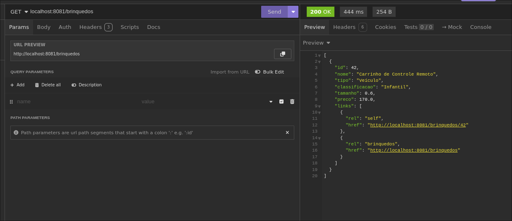
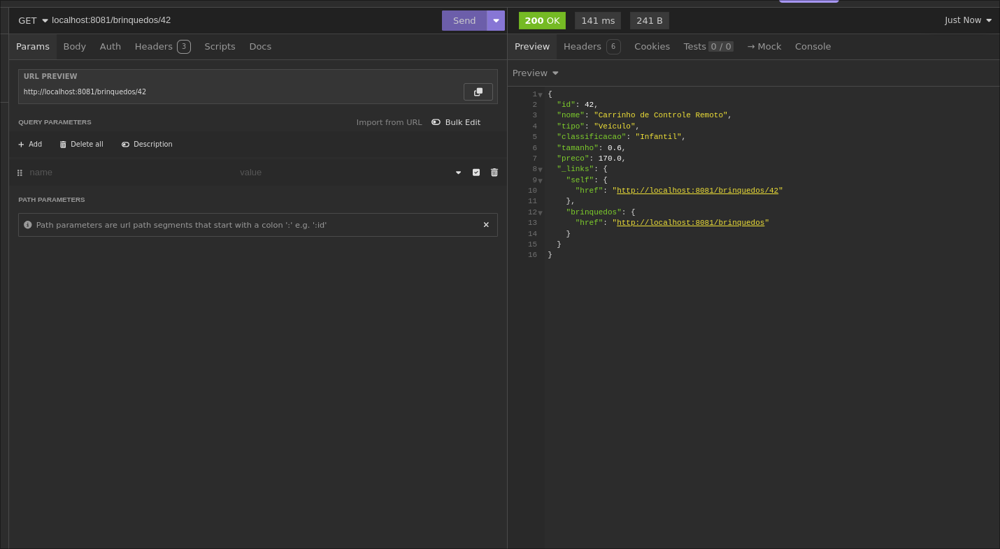
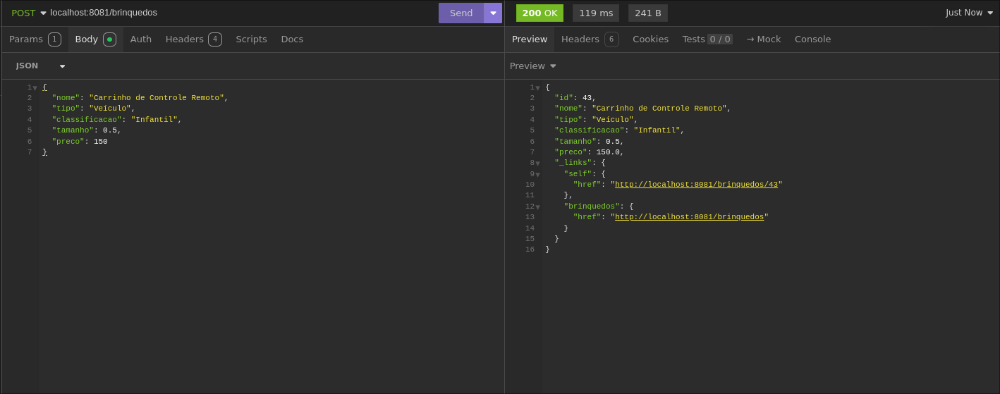
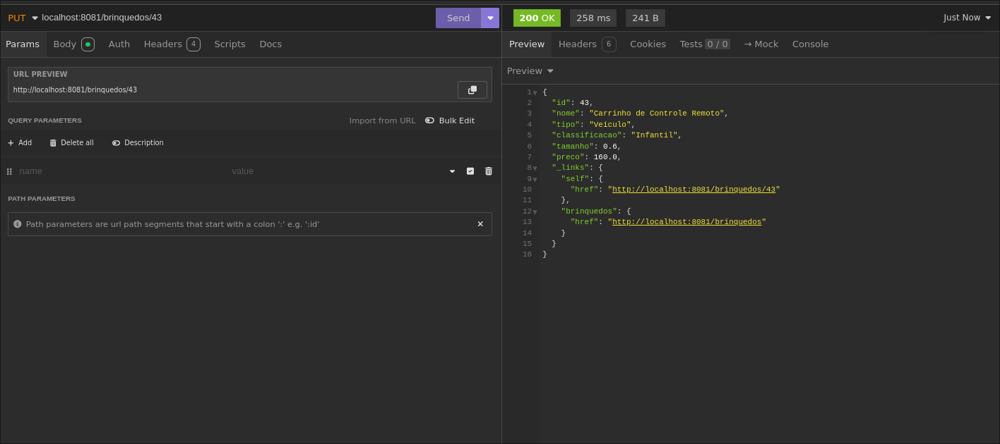
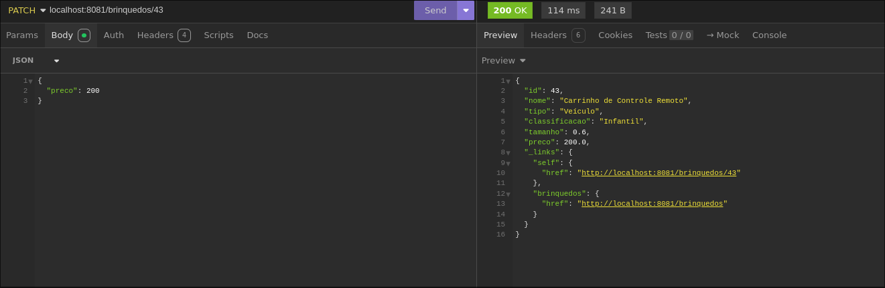
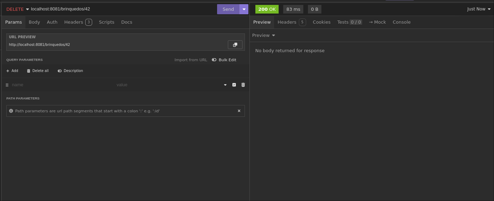

# Trankalma - Sistema de Gerenciamento de Brinquedos Esportivos

Projeto desenvolvido para o exercício de revisão da disciplina **Spring com Persistência, Lombok, HATEOAS e Deploy**  
FIAP – Faculdade de Informática e Administração Paulista  
Curso: **Tecnologia em Análise e Desenvolvimento de Sistemas (TDS)**  
Professor: **Dr. Marcel Stefan Wagner**

---

## Autores

- **Daniel Saburo Akiyama** – RM 558263
- **Danilo Correia e Silva** – RM 557540
- **João Pedro Rodrigues da Costa** – RM 558199

---

## Objetivo

Criar uma API REST para gerenciamento de brinquedos esportivos para crianças até 12 anos, com CRUD completo e persistência em banco de dados **Oracle**.

O sistema deve permitir **criar, listar, buscar, atualizar e excluir brinquedos**, com documentação via **Swagger/OpenAPI** e retorno seguindo o padrão **HATEOAS**.

---

## Tecnologias Utilizadas

- **Java 21+**
- **Spring Boot** (Maven)
- **Spring Data JPA**
- **Lombok**
- **HATEOAS**
- **Swagger / SpringDoc OpenAPI**
- **Banco Oracle (Oracle SQL Developer)**
- **Postman/Insomnia** para testes
- **Render** para deploy em plataforma de hospedagem
- **Intellij IDEA** para desenvolvimento da API

---

## Estrutura do Projeto

```
src/
 └── main/
     ├── java/br/com/fiap/trankalma
     │   ├── model/          # Entidade Brinquedo
     │   ├── repository/     # Interface de persistência JPA
     │   ├── service/        # Lógica de negócio
     │   ├── controller/     # Endpoints REST com HATEOAS
     │   └── configuration/  # Configuração do Swagger
     └── resources/
         ├── application.properties  # Configurações do banco e servidor
         └── META-INF/persistence.xml (opcional)
```

---

##  Configuração

### Banco de Dados Oracle
- Criar a tabela:

```sql
CREATE TABLE TDS_TB_BRINQUEDO (
    ID NUMBER PRIMARY KEY,
    NOME VARCHAR2(100) NOT NULL,
    TIPO VARCHAR2(50) NOT NULL,
    CLASSIFICACAO VARCHAR2(50) NOT NULL,
    TAMANHO FLOAT NOT NULL,
    PRECO FLOAT NOT NULL
);
```

- Criar a sequence:
```sql
CREATE SEQUENCE seq_brinquedo_id START WITH 1 INCREMENT BY 1;
```

---

### Como configurar o .env para rodar localmente

```env
ORACLEHOST=<HOSTDAFIAP>
ORACLEPORT=1521
ORACLEDATABASE=<DATABASE>
ORACLEUSER=<USERNAME>
ORACLEPASSWORD=<SENHA>
```

---

## Executando o Projeto

```bash
# Clonar repositório
git clone https://github.com/usuario/trankalma.git
cd trankalma

# Executar via Maven
mvn spring-boot:run
```

A API ficará disponível em:  
**http://localhost:8081**

Documentação Swagger:  
**http://localhost:8081/swagger-ui.html**

---

## Endpoints

### 1. Listar todos os brinquedos
`GET /brinquedos`

**Resposta (200)**:
```json
[
  {
    "id": 1,
    "nome": "Bola de Futebol",
    "tipo": "Bola",
    "classificacao": "Infantil",
    "tamanho": 0.3,
    "preco": 50.0,
    "_links": {
      "self": { "href": "http://localhost:8081/brinquedos/1" },
      "brinquedos": { "href": "http://localhost:8081/brinquedos" }
    }
  }
]
```

---

### 2. Buscar brinquedo por ID
`GET /brinquedos/{id}`

---

### 3. Criar brinquedo
`POST /brinquedos`

**Corpo JSON**:
```json
{
  "nome": "Carrinho de Controle Remoto",
  "tipo": "Veículo",
  "classificacao": "Infantil",
  "tamanho": 0.5,
  "preco": 150.0
}
```

---

### 4. Atualizar brinquedo (PUT)
`PUT /brinquedos/{id}`

---

### 5. Atualização Parcial (PATCH)
`PATCH /brinquedos/{id}`

---

### 6. Deletar brinquedo
`DELETE /brinquedos/{id}`

---

## Deploy

O projeto foi implantado na plataforma Render  e pode ser acessado no link:

https://exercicio-revisao-java-fiap.onrender.com

---

## Exemplos no Postman/Insomnia

### GET ALL



### GET BY ID



### SAVE



### PUT



### PATCH



### DELETE



[Json Export do Insomnia](./javainsomnia.json)

---
